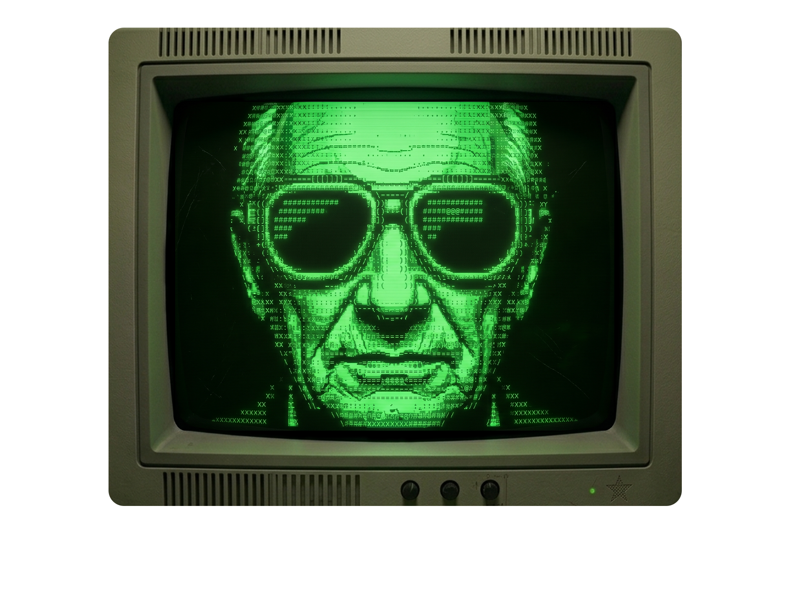

# VOXFACE — Floating Local LLM Voice & Face Desktop Widget

VOXFACE is an 80s-inspired retro CRT monitor desktop widget that serves as an animated interactive interface for local LLMs (like Ollama or LM Studio). It intercepts local LLM traffic via a built-in proxy server, speaks LLM responses using local text-to-speech (TTS), and renders a synchronized, real-time ASCII-style face. It also includes Speech-to-Text (STT) capabilities to type what you dictate directly into your active window.

---

## Preview



---

## Features
- **Retro CRT Shader**: Real-time WebGL/GLSL post-processing with scanlines, chromatic aberration, grain, phosphor bloom, and screen curvature.
- **Dynamic Lip-Syncing**: Mouth shapes (`u`, `o`, `i`, `e`, `a`, `a1`, `a2`) react in real-time to the audio volume amplitude of the speaker.
- **Speech-to-Text (STT) typing**: Dictate using Push-to-Talk (`Control + Space` hotkey) or Always Listening mode; it types the transcribed text directly into your active application.
- **Axum Proxy Server**: Runs a local API proxy on port `11430` that forwards completions to your local LLM backend.

---

## Installation & Setup

VOXFACE includes a universal setup script (`setup.py`) that automates the installation of system prerequisites (Node.js, Rust, Git), NPM modules, and machine learning models (VAD, Whisper, Piper TTS) for your specific operating system and CPU architecture.

### Step 1: Clone the Repository
Open your terminal (or PowerShell on Windows) and run:
```bash
git clone https://github.com/bluelotus1407-beep/VOXFACE.git
cd VOXFACE
```

### Step 2: Run the Setup Script
Execute the installer using Python:

#### 🐧 On Linux (Ubuntu / Mint / Debian):
First, run the system package installations manually:
```bash
sudo apt-get update && sudo apt-get install -y \
  build-essential libssl-dev libgtk-3-dev libwebkit2gtk-4.1-dev \
  librsvg2-dev pkg-config libasound2-dev python3 git nodejs npm
```
Then run the setup script to download models and packages:
```bash
python3 setup.py
```

#### 🍎 On macOS:
Make sure you have [Homebrew](https://brew.sh/) installed, then run:
```bash
python3 setup.py
```
*(The script will automatically detect your processor (Intel vs Apple Silicon M1/M2/M3/M4), install Node/Rust/Python/Git via Homebrew, compile Whisper natively, and download the correct Mac-compatible Piper voice binary).*

#### 🪟 On Windows:
Open PowerShell as Administrator and run:
```powershell
python setup.py
```
*(The script will use Windows `winget` to install Node.js, Git, and Python, download pre-compiled Windows executables for Piper TTS and Whisper.cpp, and guide you through installing the Rust compiler if it isn't found).*

---

## Running the Widget

1. Start the frontend developer server:
   ```bash
   npm run dev
   ```
2. Open a second terminal tab and start the desktop client:
   ```bash
   npm run tauri dev
   ```

---

## Connecting to your Local LLM

1. Run your local model server (e.g. **LM Studio** or **Ollama** on port `11434` or `1234`).
2. Double-click the CRT screen bezel of the widget to slide down the **System Setup** panel.
3. Configure your LLM Port, model ID, and backend URL.
4. Point your LLM Client (or application) to communicate through the VOXFACE proxy port (`http://localhost:11430`) instead of calling the LLM directly. VOXFACE will capture the streaming completions, speak them, and animate the face!
